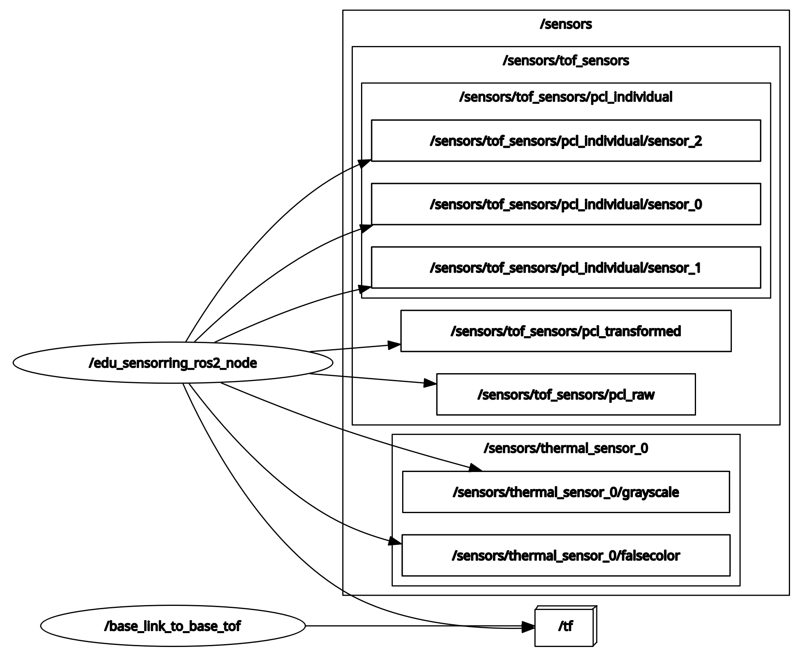

# EduArt Sensorring Ros2 Wrapper
The software interface of the EduArt Sensorring is the lightweight and framework independent [edu_lib_sensorring](https://github.com/EduArt-Robotik/edu_lib_sensorring) library. This repository is a wrapper of the library to use the Sensorring measurements in Ros2.

>Note: For a Ros1 wrapper see the [edu_sensorring_ros1](https://github.com/EduArt-Robotik/edu_sensorring_ros1) repository.

>Note: The Sensorring library currently only implements the Linux specific SocketCan interface for communication with the sensors. Therefore the Ros2 node is currently also limited to Linux systems.

# Building and running the node

The node can be run either locally on systems with a Ros2 environment or in a docker container that is also included in this repository.

## Running the node locally

To run the node locally you need to have Ros2 installed. Please refer to the official [Ros2 installation guide](https://docs.ros.org/en/jazzy/Installation.html).

### 1. Install the Sensorring library
Use the convenience script to build and install the Sensorring library on your system. Refer to the [edu_lib_sensorring](https://github.com/EduArt-Robotik/edu_lib_sensorring) repository for a detailed description of the build and installation process.

```
mkdir eduart_ws
cd eduart_ws
git clone -b master https://github.com/EduArt-Robotik/edu_lib_sensorring.git
cd edu_lib_sensorring
./cmake/install_release.bash
```
>Note:<br> If the bash script does not execute it may need to be converted to a file with unix style line endings. Run `dos2unix ./cmake/*` for an automatic conversion before executing the script.

### 2. Clone the Sensorring node into your Ros2 workspace
```
mkdir -p ~/ros2_ws/src
cd ~/ros2_ws/src
git clone -b master https://github.com/EduArt-Robotik/edu_sensorring_ros2.git
```

### 3. Build the node
The node uses the standard Ros2 `colcon build` toolchain.
```
cd ~/ros2_ws
colcon build --packages-select edu_sensorring_ros2 --symlink-install
source ~/ros2_ws/install/setup.bash
```

### 4. Start the node
To start the node use the included launchfile.
```
cd ~/ros2_ws
source install/setup.bash
ros2 launch edu_sensorring_ros2 sensorring.launch.py
```

>Note:<br> The launchfile launches the node in a namespace that is set by the environment variable `EDU_ROBOT_NAMESPACE`. The default value is `eduard`.

>Note:<br> The launchfile [sensorring.launch.py](launch/sensorring.launch.py) uses the parameter set [auto_discover_params.yaml](params/auto_discover_params.yaml). You likely need to change the parameters to match your hardware configuration. Either create your own launchfile and parameter file or adjust the existing parameter file.

# Configuration Modes

The node supports three configuration modes that control how hardware discovery and topology validation are handled. The mode is selected via two parameters in `base_setup`:

| `auto_discover` | `enforce_topology` | Mode | Description |
|---|---|---|---|
| `true` | *(ignored)* | **Auto-Discover** | No sensor boards need to be declared. The factory discovers all connected hardware on the configured interfaces. All sensor poses default to identity (zero rotation/translation). Ideal for quick testing or setups where precise transforms are not needed. |
| `false` | `false` | **Relaxed** | Sensor boards are declared with their poses in the parameter file. The factory matches declared boards to physical hardware but **ignores** any extra connected boards not listed in the configuration. This is the default mode. |
| `false` | `true` | **Strict** | Sensor boards are declared with their poses in the parameter file. Every declared board **must** match a physical board exactly. If any declared board is missing or unexpected boards are found, the node will fail to start. Use this for production deployments where the topology must be guaranteed. |

## Factory Topology API

The ROS2 node is configured for the current `edu_lib_sensorring` factory API.

In non-auto-discover mode, each configured board is declared in two steps:

1. `expectBoard(board_params)` declares the board pose and board-level information.
2. `expectDevice(...)` is optionally called to define which devices are expected on that board.

This replaces the older pattern where a board and a device list were passed together in one call.

## Auto-Discover Mode

The simplest configuration only requires specifying the communication interface(s). The node will discover all connected sensor boards and start publishing measurements immediately. Sensor poses are identity (all points in their local sensor frame).

```yaml
pointcloud_sensor:
  base_setup:
    auto_discover: true
  topology:
    nr_of_interfaces: 1
    interfaces:
      interface_0:
        interface_type: "socketcan"
        interface_name: "can0"
```

Use the included launch file for auto-discovery:
```
cd ~/ros2_ws
source install/setup.bash
ros2 launch edu_sensorring_ros2 auto_discover_sensorring.launch.py
```

## Relaxed Mode (Default)

Declare the boards you care about with their poses. Any additional connected boards will be silently ignored. This is useful when you only want to process a subset of the connected sensors.

```yaml
pointcloud_sensor:
  base_setup:
    auto_discover: false
    enforce_topology: false
  topology:
    nr_of_interfaces: 1
    interfaces:
      interface_0:
        interface_type: "socketcan"
        interface_name: "can0"
        nr_of_boards: 3
        boards:
          board_0:
            board_type: "headlight"
            expected_devices: ["any_depth", "htpa32", "any_light"]
            orientation: "left"
            rotation: [90.0, 0.0, 45.0]
            translation: [0.1, 0.0, 0.05]
          # ... more boards
```

If `board_type` is omitted or left empty, the factory will match any compatible board. If `expected_devices` is an empty array, all discovered devices on the matched board are instantiated.

## Parameter Reference

The node reads all parameters below the `pointcloud_sensor` namespace.

### base_setup

| Parameter | Type | Default | Description |
|---|---|---|---|
| `base_setup.timeout_ms` | integer | `1000` | Measurement manager timeout in milliseconds. |
| `base_setup.repair_errors` | bool | `true` | Enables automatic recovery attempts inside the measurement manager. |
| `base_setup.tf_name` | string | `"base_sensorring"` | Root frame used for published transforms and transformed point clouds. |
| `base_setup.enforce_topology` | bool | `false` | Enables strict topology validation when `auto_discover` is `false`. |
| `base_setup.auto_discover` | bool | `false` | If `true`, no boards are configured explicitly and all detected hardware is used. |
| `base_setup.publishers.depth_individual` | bool | `true` | Publish one point cloud topic per detected depth sensor. |
| `base_setup.publishers.depth_combined` | bool | `true` | Publish one transformed point cloud with all depth sensors combined. |
| `base_setup.publishers.depth_raw` | bool | `true` | Publish one untransformed point cloud with all depth sensors combined. |

### Device Defaults

These parameters define default configuration values that are applied whenever a matching device is instantiated by the factory.

| Parameter | Type | Default | Description |
|---|---|---|---|
| `htpa32_config.auto_min_max` | bool | `true` | Automatically derive grayscale / false-color temperature limits from the image. |
| `htpa32_config.use_eeprom_file` | bool | `false` | Load thermal EEPROM data from files instead of reading it from hardware at startup. |
| `htpa32_config.use_calibration_file` | bool | `false` | Load saved thermal calibration data from files. |
| `htpa32_config.eeprom_file_dir` | string | `""` | Directory containing stored EEPROM dumps for thermal sensors. |
| `htpa32_config.calibration_file_dir` | string | `""` | Directory containing saved thermal calibration files. |
| `htpa32_config.scale_t_min_deg` | double | `20.0` | Lower bound in degree Celsius for thermal image scaling when auto scaling is disabled. |
| `htpa32_config.scale_t_max_deg` | double | `30.0` | Upper bound in degree Celsius for thermal image scaling when auto scaling is disabled. |
| `htpa32_config.max_rate_hz` | double | `5.0` | Maximum measurement rate for HTPA32 thermal sensors. |
| `vl53l8cx_config.max_rate_hz` | double | `15.0` | Maximum measurement rate for VL53L8CX depth sensors. |
| `tmf8829_config.resolution_mode` | integer | `3` | TMF8829 resolution preset. `3` corresponds to `16x16`. |
| `tmf8829_config.k_iterations` | integer | `0` | TMF8829 integration / iteration setting. |
| `tmf8829_config.max_rate_hz` | double | `30.0` | Maximum measurement rate for TMF8829 depth sensors. |
| `led_config.initial_mode` | integer | `0` | Initial light mode applied to all detected light devices when the node starts. Valid values: `0..12` (`0=Off`, `1=Dimmed`, `2=HighBeam`, `3=FlashAll`, `4=FlashLeft`, `5=FlashRight`, `6=Pulsation`, `7=Rotation`, `8=Running`, `9=MapDistance`, `10=FixedColor`, `11=PulsationColor`). |
| `led_config.initial_color` | integer array `[r,g,b]` | `[0, 0, 0]` | Initial RGB color applied together with `initial_mode`. Each value must be in `[0, 255]`. |

### topology

| Parameter | Type | Default | Description |
|---|---|---|---|
| `topology.nr_of_interfaces` | integer | `1` | Number of communication interfaces to configure. |
| `topology.interfaces.interface_N.interface_type` | string | `"undefined"` | Interface backend. Supported values: `socketcan`, `usbtingo`. |
| `topology.interfaces.interface_N.interface_name` | string | `"can0"` | OS-visible interface name, for example `can0` or a USB adapter name. |
| `topology.interfaces.interface_N.enable_brs` | bool | `false` | Enables CAN-FD bitrate switching if the backend supports it. |
| `topology.interfaces.interface_N.data_baudrate` | integer | `0` | Optional CAN-FD data baudrate override. |
| `topology.interfaces.interface_N.sample_point` | double | `0.0` | Optional interface sample-point override. |
| `topology.interfaces.interface_N.nr_of_boards` | integer | `1` | Number of expected boards on this interface when `auto_discover` is `false`. |

Each configured board is declared below `topology.interfaces.interface_N.boards.board_M`.

| Board Parameter | Type | Default | Description |
|---|---|---|---|
| `board_type` | string | `""` | Optional hardware board type constraint. Supported values: `headlight`, `taillight`, `sidepanel`, `minipanel`. If empty, any compatible board may match. |
| `expected_devices` | string array | `[]` | Optional expected devices for that board. If empty, all discovered devices on the matched board are instantiated. |
| `orientation` | string | `"none"` | Board orientation used by devices that need left/right aware processing. Supported values: `none`, `left`, `right`. |
| `rotation` | double array `[roll,pitch,yaw]` | `[0.0, 0.0, 0.0]` | Board rotation in degrees. Applied in roll-pitch-yaw order. |
| `translation` | double array `[x,y,z]` | `[0.0, 0.0, 0.0]` | Board translation in meters. |

Supported `expected_devices` entries:

| Value | Meaning |
|---|---|
| `vl53l8cx` | Require a VL53L8CX depth sensor. |
| `tmf8829` | Require a TMF8829 depth sensor. |
| `htpa32` | Require an HTPA32 thermal sensor. |
| `ws2812b` | Require a WS2812b light device. |
| `any_depth` | Accept any supported depth sensor on that board. |
| `any_thermal` | Accept any supported thermal sensor on that board. |
| `any_light` | Accept any supported light device on that board. |

The aliases `tof`, `depth`, `thermal`, `light`, and `led` are also accepted by the node parser.

## Strict Mode

Same as relaxed mode but the factory validates that the declared topology exactly matches the physical hardware. Use this in production to catch wiring or hardware issues early.

```yaml
pointcloud_sensor:
  base_setup:
    auto_discover: false
    enforce_topology: true
```


## Running the node in a container

Running the node in a container offers some advantages over natively running the node. It allows you to ...
- ... skip the manual installation of dependencies (e.g. the edu_lib_sensorring)
- ... run the node without installing Ros on your native system
- ... quickly change between different distributions of Ros
- ... autostart the node after boot

To use the container you need to install Docker. Please refer to the official [Docker installation guide](https://docs.docker.com/engine/install/).

### 1. Clone the Sensorring node into your workspace
```
mkdir ~/eduart_ws
cd ~/eduart_ws
git clone -b master https://github.com/EduArt-Robotik/edu_sensorring_ros2.git
```

### 2. Build the container
The container has to be built once after cloning the repository. During the build all dependencies are installed in the container.
```
cd ~/eduart_ws/edu_sensorring_ros2/docker
docker compose build
```

### 3. Start the container
Start the container by running `docker compose up`. The container is configured to restart automatically including after rebooting your system.
```
cd ~/eduart_ws/edu_sensorring_ros2/docker
docker compose up -d
```

You can verify that the container is running by listing all active containers. The list should include the Sensorring container.
```
docker ps
```
>Note:<br>The container uses some environment variables of the host system. Set the following variables according to your setup:<br>- EDU_ROBOT_NAMESPACE: Prefix for the Ros topics and Ros services of the node<br>- RMW_IMPLEMENTATION: Middleware implementation of Ros2 (e.g. "rmw_fastrtps_cpp") <br>- ROS_DOMAIN_ID: Specify a custom domain for the node (e.g. "42")

### 4. Stop the container
To stop the container and remove it from the autostart run `docker compose down`.
```
cd ~/eduart_ws/edu_sensorring_ros2/docker
docker compose down
```

Again you can verify that the container has stopped by listing all active containers. The Sensorring container should no longer be listed.
```
docker ps
```

# Ros interface of the node

## 1. Overview
This is a screenshot of the `rqt_graph` while the edu_sensorring_ros2 node is running. In the example the sensor board 0 has a ToF and a thermal sensor, the boards 1 and 2 only have ToF sensors. The Node publishes one point cloud per tof sensor and two combined point clouds with the measurements from all sensors. The first combined point cloud includes the raw points from all sensors, and the second one includes the transformed points in a common coordinate frame. The default launchfile also includes a static transform publisher that defines a reference frame for the Sensorring measurements.



## 2. Publisher

### /sensors/tof_sensors/pcl_individual/sensor_*
There is one publisher per sensor board that publishes the point cloud data from its ToF sensor in the sensor coordinate frame. The message type is a [`sensor_msgs/msg/PointCloud2`](https://docs.ros2.org/foxy/api/sensor_msgs/msg/PointCloud2.html). The individual pxl publishers can be used as input for a voxel layer for autonomous navigation.

### /sensors/tof_sensors/pcl_raw
There is one publisher that publishes the point cloud data from all Time-of-Flight sensors of the Sensorring. The message type is a [`sensor_msgs/msg/PointCloud2`](https://docs.ros2.org/foxy/api/sensor_msgs/msg/PointCloud2.html). The combined measurements are **not** transformed into a common coordinate system. The points from the individual sensors can be distinguished by the PointField `sensor_idx` in the point cloud message.

### /sensors/tof_sensors/pcl_transformed
There is one publisher that publishes the point cloud data from all Time-of-Flight sensors of the Sensorring. The message type is a [`sensor_msgs/msg/PointCloud2`](https://docs.ros2.org/foxy/api/sensor_msgs/msg/PointCloud2.html). The combined measurements are transformed into a common coordinate system. The points from the individual sensors can be distinguished by the PointField `sensor_idx` in the point cloud message.

### /sensors/thermal_sensor_*/falsecolor
There is one publisher for each sensor that publishes a falsecolor image of the thermal measurement. The message type is [`sensor_msgs/msg/Image`](https://docs.ros2.org/foxy/api/sensor_msgs/msg/Image.html).

### /sensors/thermal_sensor_*/grayscale
There is one publisher for each thermal sensor that publishes a grayscale image of the thermal measurement. The message type is [`sensor_msgs/msg/Image`](https://docs.ros2.org/foxy/api/sensor_msgs/msg/Image.html).

## 3. Subscriber
There are currently no subscribers in the edu_sensorring_ros2 node.

## 4. Services

### /startThermalCalibration
The service `startThermalCalibration` starts the calibration process of the thermal sensors. The calibration compensates a vignette effect that is apparent in the thermal measurements.

```
ros2 service call /eduard/edu_sensorring_ros2_node/startThermalCalibration edu_sensorring_ros2/srv/StartThermalCalibration "window: 20"
```

>Thermal calibration:<br>1. Run the Sensorring node for 10 to 20 minutes that all sensors reach a steady operating temperature.<br>2. Place an object in front of the thermal sensors that covers the whole sensor area and has a uniform surface and uniform temperature, e.g. a cardboard box. Don't touch the side of your calibration target that is facing the sensor directly before the calibration.<br>3. Call the thermal calibration service. The window size defines how many thermal frames are averaged for the calibration. Recommended values are 20 to 100 frames.<br>4. Wait for the calibration to finish. If the `use_calibration_file` parameter is set to `true` the calibration values are automatically stored in a file and loaded at each start of the node.

### /stopThermalCalibration
The service `stopThermalCalibration` stops the calibration process of the thermal sensors in case the process takes too long.
```
ros2 service call /eduard/edu_sensorring_ros2_node/stopThermalCalibration edu_sensorring_ros2/srv/StopThermalCalibration "stop: true"
```
